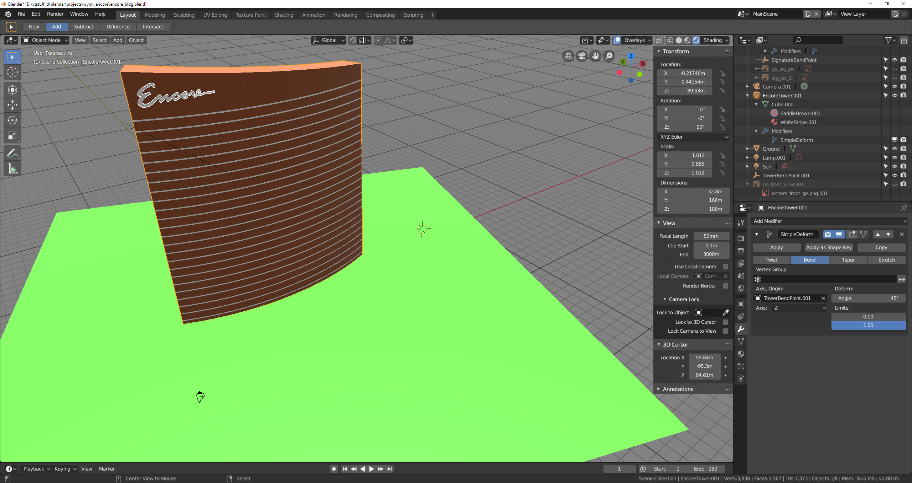
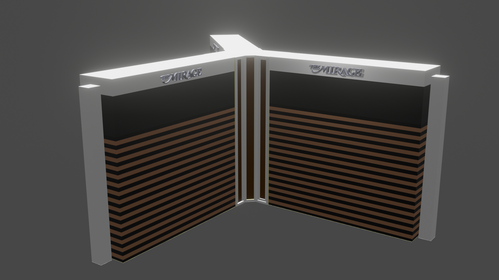
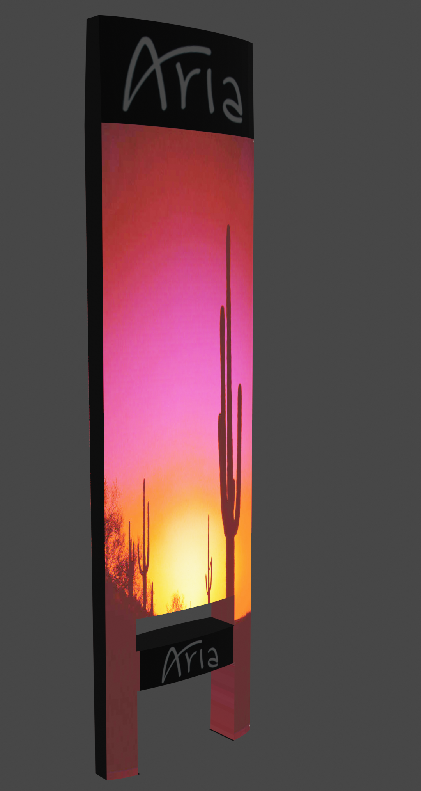
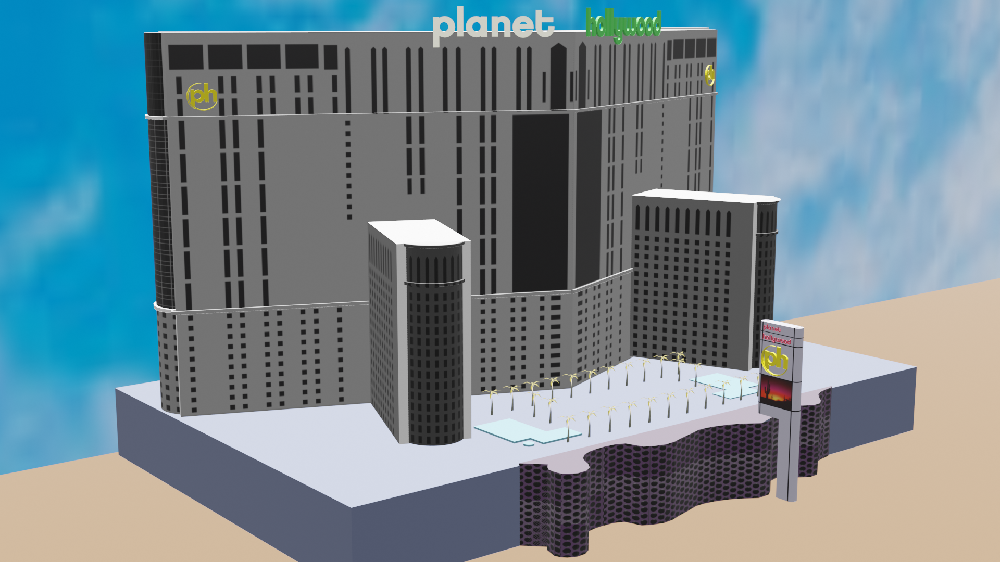
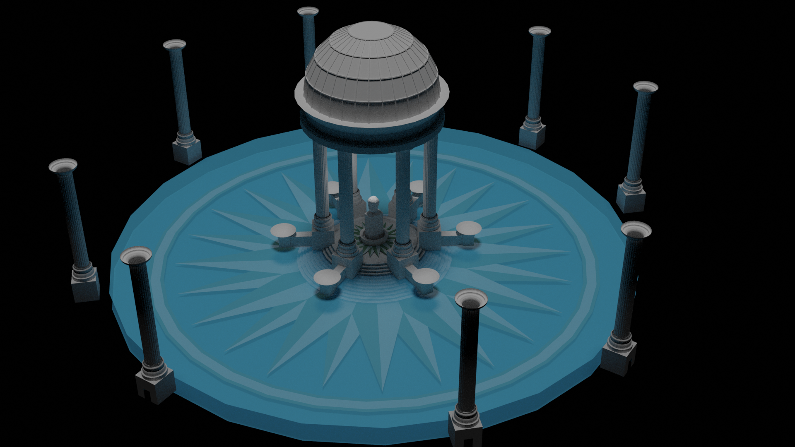
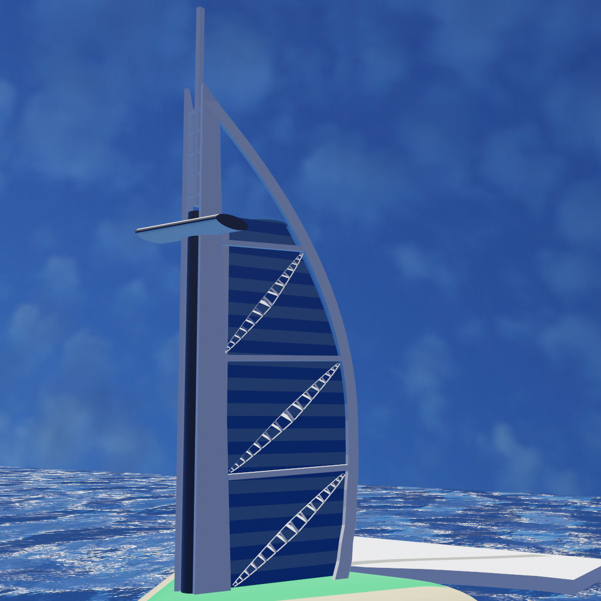
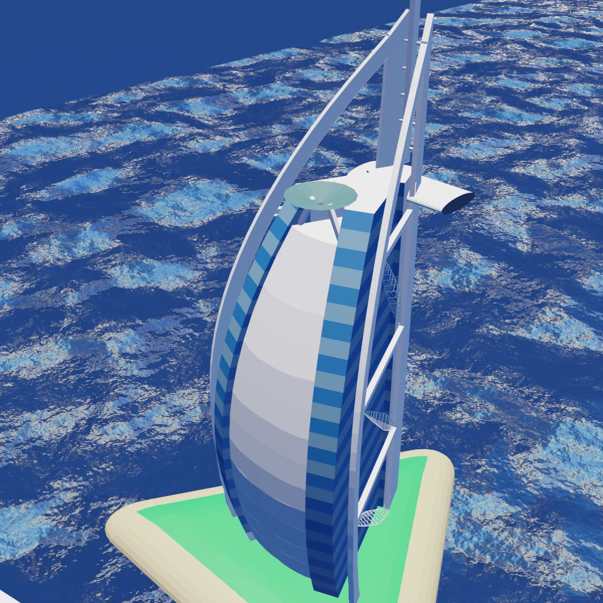

<!-- Note: none of the attempted css solutions work.  see https://www.xaprb.com/blog/how-to-style-images-with-markdown/ -->
<!-- I'm just leaving in in case I feel like trying to get it to work again -->
<head>
<link rel="stylesheet" type="text/css" href="/readme.css">
</head>
<!--  -->

# blender-las-vegas
Just having a little bit of fun modelling some Las Vegas (and Dubai) hotels using Blender 2.8.  Entries at the top are my earlier attempts, while the ones at the bottom are my later attempts.  Hopefully you'll notice an increase in complexity and improvement in quality as you move down, mirroring the progression of my Blender skills.

<!--  -->

<!--  -->

Temple Pool, Caesar's Palace.

Burj Al Arab Hotel, Dubai.

<!--  -->
<!-- 
</img> -->
  <!-- style="display: block; max-width:200px; max-height: 200px; width: auto; height: auto; " -->
 </img>
 </img>
 </img>
